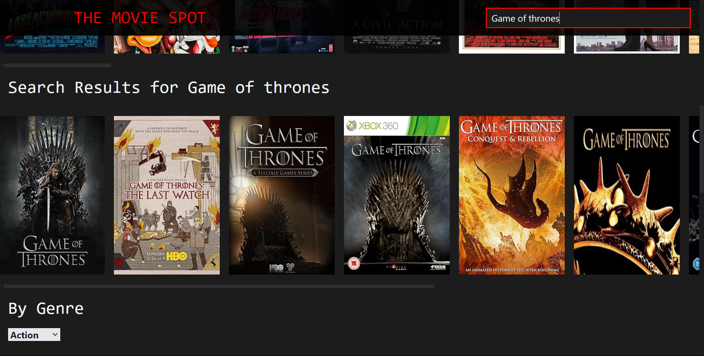
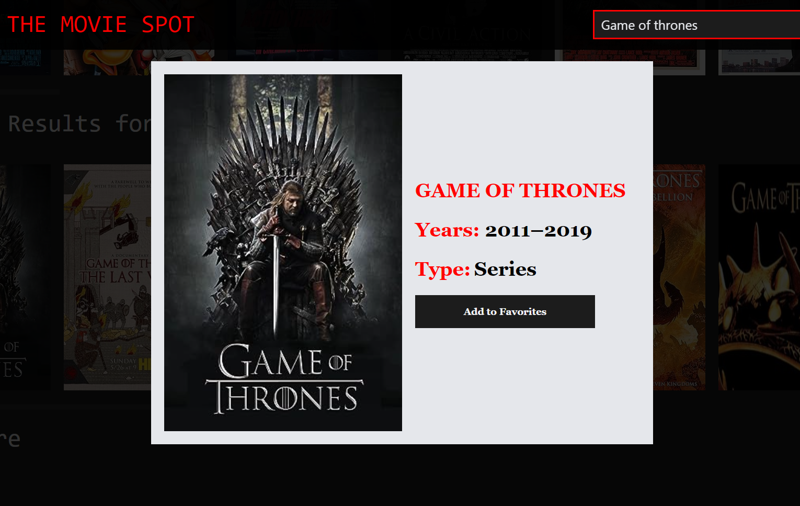

# The Movie Spot

The Movie Spot is a responsive user-friendly website. It allows users to browse and search a large collection of movies, and save their favorites for quick access.

## Core Features

- Search for movies or series by their title, and filter them by type (movie or series) or latest releases.
- 'Add to Favorites' option for easy access.

## Tech Stack

**Frontend:** ReactJS, TailwindCSS

**API Integration:** Data fetched from [OMDB API](https://www.omdbapi.com/)

**Version Control:** Git and Github

## Demo

[View Demo](https://master--the-movie-spot.netlify.app/)

## Screenshots

